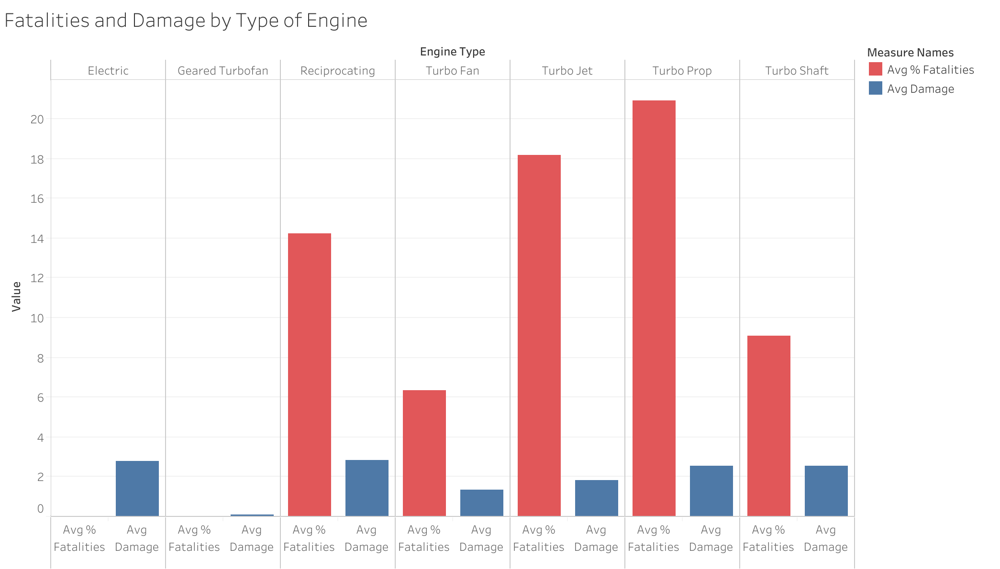
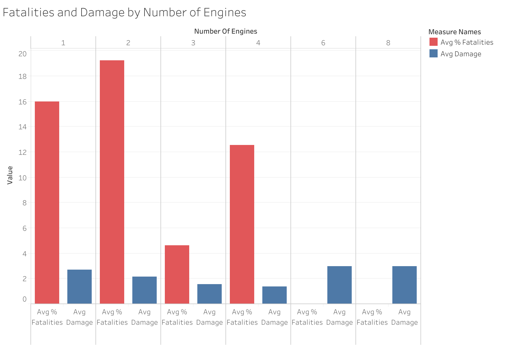
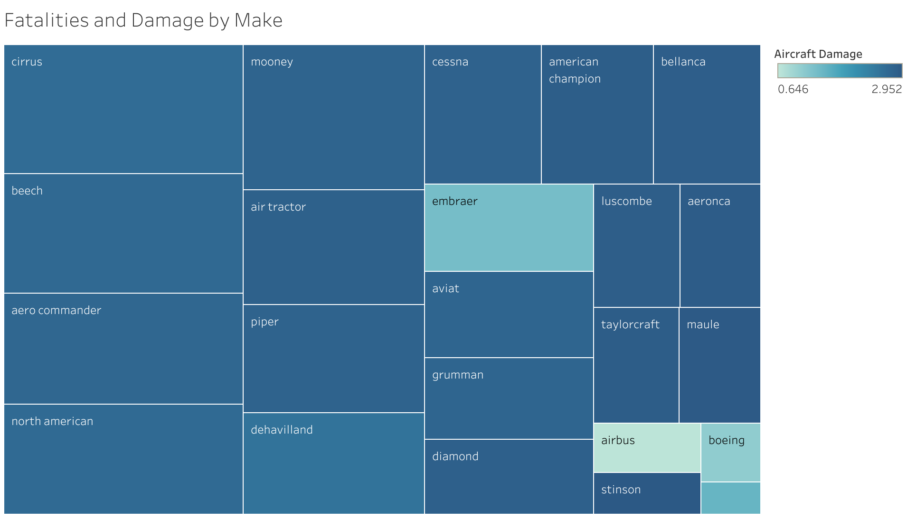

# Aviation Exploration Analysis
## Overview
Our company Patley is making the venture into the airline industry in order to diversify our portfolio. We have been tasked with determining which aircraft carry the lowest risk. The data has been provided in this [Aviation Accident Database 1948-2022](https://www.kaggle.com/datasets/khsamaha/aviation-accident-database-synopses) which is publicly available through [kaggle](https://www.kaggle.com/) datasets.  
## Business Understanding
Requirements and objectives from our new director of aviation is to decide which aircraft our less accident prone and generally safer so that our company can purchase them.
## Data Understanding
### Examining the data with a wider lens
We were given a `.csv` file [Aviation_Data](https://github.com/pyamin1878/Airline_DS_Project/blob/main/Data/Aviation_Data.csv) of raw data from the National Transportation Safety Board [NTSB](https://www.ntsb.gov/Pages/AviationQueryv2.aspx) that we imported into a jupyter notebook with [pandas](https://pandas.pydata.org/) a flexible python tool for data analysis and manipulation. 
### Rows
- Specifies that each incident that occurs with aircraft as an `'accident'` 
### Columns
- The location, region, and event date of where accidents occured
- The specifications of each aircraft including the make, model, engine type, and `n` of engines
- Injuries were listed in columns with subcategories: fatal, nonfatal, minor, injured, and uninjured
- The last few columns mention flight status as well as weather conditions

There was also a substantial portion of the dataset that contained null values that we will remove during data prep.

We provide two cleaned datasets in the [Final Data](https://github.com/pyamin1878/Airline_DS_Project/tree/main/Final_Data) directory if you would like to use that as a starting point. 
## Data Preparation
In order to prepare the data for analysis and visualization for business recommendations, a significant portion of cleaning and manipulation was required. Our goal was to create a cleaned subset of data with only relevant columns and no nulls. We replaced nulls with zeroes, measures of central tendancy, and common terms such as "N/A." Lastly we used a pandas method [.groupby()](https://pandas.pydata.org/docs/reference/api/pandas.DataFrame.groupby.html) to aggregate and transform the data.
## Analysis and Results/Recommendations
### Recommendation 1: Safest engine type based off fatal vs non fatal injuries
- For the first business recommendation, we have analyzed percentages of fatal vs non-fatal injuries according to the engine type of each aircraft in the dataset. The best engine we could recommend based off our data is **turbofan**.   
- We are excluding electric, geared turbofan, and turbo shaft because we have fewer than twelve data points for these three types of engines. 


### Recommendation 2: Single engine plane has less fatalities but more damage
- There is more damage in a single engine plane based on average percentages in our data, but they are much more cost effective to purchase and maintain. 
- Twin or Dual engine planes have the highest fatal injury rate, but when an incident occurs it has a lower rate of aircraft damage.
- We recommend single engine planes for private chartered planes, and dual engine planes for commerical flights.


### Recommendation 3: Purchasing airplanes based on make
- The 'make' or manufacturers that we can recommend purchasing from are Airbus, Boeing, and McDonnell Douglas. These airplane makes have the lowest aircraft damage and the lowest amount of fatalities on average.



We provided a Tableau Dashboard with following visuals here: [Dashboard](https://public.tableau.com/app/profile/shelley.w8788/viz/AirlineProj2/Dashboard2)

Presentation slides: [Presentation](Images/Aviation_Data_Analysis_Presentation_1.pdf)
## Conlusion and Next Steps
We can assert that Boeing and Airbus are the two aviation companies that are making the highest calibre of aircraft for safety. If we are purchasing for chartered flights or private jets it's best to go with single engine airplanes. Otherwise dual engine airplanes would be the best fit for commercial usage.

#### Potential Next Steps

**Predictive Analysis**: Utilize machine learning algorithms to predict outcomes or classify incidents based on the features in our dataset. Start with simple models like logistic regression or decision trees, and then explore more complex models such as deep learning with neural networks. 

**Publication and Documentation**: Writing a detailed report or academic paper on our findings, or improving the documentation in our repository for better understanding and reproducibility. Uploading our EDA to Kaggle to get feedback from the data science community. 

## Repo Structure
```
├── Data
├── Final Data
│   ├── df_subset_makes.csv
│   ├── subset.csv
├── Images
├── Notebooks
│   ├── pat_working_notebook.ipynb
│   ├── shelley_working_notebook.ipynb
├── .gitignore
├── Final.ipynb
├── LICENSE
├── README.md
```